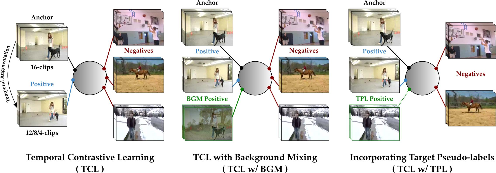

# Contrast and Mix (CoMix)
The repository contains the codes for the paper **Contrast and Mix: Temporal Contrastive Video Domain Adaptation with Background Mixing** part of Advances in Neural Information Processing Systems (NeurIPS) 2021. 

[Aadarsh Sahoo<sup>1</sup>](https://aadsah.github.io/), [Rutav Shah<sup>1</sup>](https://www.linkedin.com/in/rutav-shah-01a2941a7/?originalSubdomain=in), [Rameswar Panda<sup>2</sup>](https://rpand002.github.io/), [Kate Saenko<sup>2,3</sup>](http://ai.bu.edu/ksaenko.html), [Abir Das<sup>1</sup>](https://cse.iitkgp.ac.in/~adas/)

<sup>1</sup> IIT Kharagpur, <sup>2</sup> MIT-IBM Watson AI Lab, <sup>3</sup> Boston University

[[Paper]](https://openreview.net/pdf?id=a1wQOh27zcy) [[Project Page]](https://cvir.github.io/projects/comix)

&nbsp;
<p align="center">

</p>
<p align="center">
<b>Fig. Temporal Contrastive Learning with Background Mixing and Target Pseudo-labels.</b> Temporal contrastive loss (left) contrasts a single temporally augmented positive (same video, different speed) per anchor against rest of the videos in a mini-batch as negatives. Incorporating background mixing (middle) provides additional positives per anchor possessing same action semantics with a different background alleviating background shift across domains. Incorporating target pseudo-labels (right) additionally enhances the discriminabilty by contrasting the target videos with the same pseudo-label as positives against rest of the videos as negatives. </p>
&nbsp;


### Preparing the Environment

#### Conda 
Please use the `comix_environment.yml` file to create the conda environment `comix` as:

```
conda env create -f comix_environment.yml
```

#### Pip
Please use the `requirements.txt` file to install all the required dependencies as:

```
pip install -r requirements.txt
```


### Data Directory Structure
All the datasets should be stored in the folder `./data` following the convention `./data/<dataset_name>` and it must be passed as an argument to `base_dir=./data/<dataset_name>`. 
##### UCF - HMDB
For `ucf_hmdb` dataset with `base_dir=./data/ucf_hmdb` the structure would be as follows:

    .
    ├── ...
    ├── data
    │   ├── ucf_hmdb
    │   │   ├── ucf_videos
    |   |   |   ├── <video-1>
    |   |   |   |   ├── <frame-1>
    |   |   |   |   ├── <frame-2>
    |   |   |   |   ├── ...
    |   |   |   ├── <video-2>
    |   |   |   ├── ...
    │   │   ├── hmdb_videos
    |   |   ├── ucf_BG
    |   |   └── hmdb_BG
    │   └──
    └──
    
##### Jester
For `Jester` dataset with `base_dir=./data/jester` the structure would be as follows 

    .
    ├── ...
    ├── data
    │   ├── jester
    |   |   ├── jester_videos
    |   |   |   ├── <video-1>
    |   |   |   |   ├── <frame-1>
    |   |   |   |   ├── <frame-2>
    |   |   |   |   ├── ...
    |   |   |   ├── <video-2>
    |   |   |   ├── ...
    |   |   ├── jester_BG
    |   |   |   ├── <video-1>
    |   |   |   |   ├── <Backgorund frame>
    |   |   |   ├── ...
    └── └── └──

##### Epic-Kitchens
For `Epic Kitchens` dataset with `base_dir=./data/epic_kitchens` the structure would be as follows (we follow the same structure as in the original dataset) : 

    .
    ├── ...
    ├── data
    │   ├── epic_kitchens
    |   |   ├── epic_kitchens_videos
    |   |   |   ├── train
    |   |   |   |   ├── D1
    |   |   |   |   |   ├── <video-1>
    |   |   |   |   |   |   ├── <frame-1>
    |   |   |   |   |   |   ├── <frame-2>
    |   |   |   |   |   |   ├── ...
    |   |   |   |   |   ├── <video-2>
    |   |   |   |   |   ├── ...
    |   |   |   |   ├── D2
    |   |   |   |   └── D3
    |   |   |   └── test
    └── └── └── epic_kitchens_BG


For using datasets stored in some other directories, please pass the parameter `base_dir` accordingly. 

### Background Extraction using Temporal Median Filtering

Please refer to the folder `./background_extraction` for the codes to extract backgrounds using temporal median filtering.


### Data

All the required split files are provided inside the directory `./video_splits`.

The official download links for the datasets used for this paper are: [[UCF-101]](https://www.crcv.ucf.edu/data/UCF101.php) [[HMDB-51]](https://serre-lab.clps.brown.edu/resource/hmdb-a-large-human-motion-database/) [[Jester]](https://20bn.com/datasets/jester) [[Epic Kitchens]](https://epic-kitchens.github.io/2021)


### Training CoMix

Here are some of the sample and recomended commands to train CoMix for the transfer task of:


 `UCF -> HMDB` from `UCF-HMDB` dataset:

```
CUDA_VISIBLE_DEVICES=0,1,2,3 python main.py --manual_seed 1 --dataset_name UCF-HMDB --src_dataset UCF --tgt_dataset HMDB --batch_size 8 --model_root ./checkpoints_ucf_hmdb --save_in_steps 500 --log_in_steps 50 --eval_in_steps 50 --pseudo_threshold 0.7 --warmstart_models True --num_iter_warmstart 4000 --num_iter_adapt 10000 --learning_rate 0.01 --learning_rate_ws 0.01 --lambda_bgm 0.1 --lambda_tpl 0.01 --base_dir ./data/ucf_hmdb
```


 `S -> T` from `Jester` dataset:

```
CUDA_VISIBLE_DEVICES=0,1,2,3 python main.py --manual_seed 1 --dataset_name Jester --src_dataset S --tgt_dataset T --batch_size 8 --model_root ./checkpoints_jester --save_in_steps 500 --log_in_steps 50 --eval_in_steps 50 --pseudo_threshold 0.7 --warmstart_models True --num_iter_warmstart 4000 --num_iter_adapt 10000 --learning_rate 0.01 --learning_rate_ws 0.01 --lambda_bgm 0.1 --lambda_tpl 0.1 --base_dir ./data/jester
```


 `D1 -> D2` from `Epic-Kitchens` dataset:

```
CUDA_VISIBLE_DEVICES=0,1,2,3 python main.py --manual_seed 1 --dataset_name Epic-Kitchens --src_dataset D1 --tgt_dataset D2 --batch_size 8 --model_root ./checkpoints_epic_d1_d2 --save_in_steps 500 --log_in_steps 50 --eval_in_steps 50 --pseudo_threshold 0.7 --warmstart_models True --num_iter_warmstart 4000 --num_iter_adapt 10000 --learning_rate 0.01 --learning_rate_ws 0.01 --lambda_bgm 0.01 --lambda_tpl 0.01 --base_dir ./data/epic_kitchens
```


For detailed description regarding the arguments, use:

```
python main.py --help
```

### Citing CoMix

If you use codes in this repository, consider citing CoMix. Thanks!

```
@article{sahoo2021contrast,
  title={Contrast and Mix: Temporal Contrastive Video Domain Adaptation with Background Mixing},
  author={Sahoo, Aadarsh and Shah, Rutav and Panda, Rameswar and Saenko, Kate and Das, Abir},
  journal={Advances in Neural Information Processing Systems},
  volume={34},
  year={2021}
}
```
